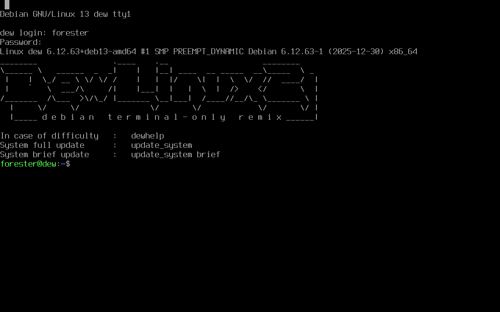

# DEWLINUX: THE DEBIAN TERMINAL-ONLY REMIX



## STATUS

- 2026-04-08: PROJECT VERSION 2. Project now evolved into a full Debian Remix. User experience significantly improved, required user interaction during installations reduced to the bare minimum. Added a modified installer, to help with installation. Installation polished significantly. Project is now mature and stable. Documentation is updated.
- 2026-04-03: PROJECT VERSION 1. Added versioning, scripts polished.
- 2026-03-11: PHASE3 Start. Project DEW Introductory video is uploaded.
- 2026-02-03: PHASE1 and PHASE2 Start.

## DESCRIPTION

**DEWLINUX** is a Terminal-Centric Debian Remix designed for a streamlined CLI workflow.

**GOAL:** Provide a modern terminal-only environment, comfortable enough for new terminal users to explore the boundaries of a terminal-only user experience and discover what is possible to be accomplished on such a system in 2026 in comparison to what was possible on a similar system in 1994.

**PRIMARY PLATFORM:** Virtual Machines. At the moment I do not have a spare laptop to test on. Maybe would get one in the next months.

**SHOWCASE:** Tutorials and showcase videos are available on [my Youtube channel](https://www.youtube.com/@SkateCode). Please subscribe for updates!

**PRIMARY USE CASE:** Home-based system for everyday personal use, without additional peripheral devices, like printers etc. Primary input controller is assumed to be a standard keyboard and a mouse.

> NOTE: "DEWLINUX" and "PROJECT DEW" are used interchangeably and do mean the same thing - the product on this GitHub repository.

## DOCUMENTATION AND WHAT IS INSTALLED

To read the documentation, run `dewhelp` from any directory.

## DISTRO

> debian-13.3.0-amd64-netinst.iso

My goal was never to use the most bare bone distro. While I have some experience with some unix distros, some RedHat derivatives, I am mostly experienced in pure Debian and some of the derivative distros, so Debian was the natural choice for me. While I am experimenting to go a bit hardcore, it was never my goal to go fully hardcore for which Devuan was never considered.

## INSTALLATION

> DISCLAIMER: The following instructions and code base represent a tested and verified installation and workflow ONLY for the above mentioned linux distro. If you're using another operating system of any sort, please keep in mind my goal was never to publish a multi-platform code. You are free to modify and adapt this project for your own OS and needs. This software is provided "as is". Use at your own risk. The developer of this code is not responsible for any possible data loss or hardware malfunctions.

> NOTE: This code was tested only on a Virtual Machine. You are free to use it on a real computer on your own risk. 

### INSTALLATION OF THE MAIN COMPONENTS

- Download the [PROJECT DEWLINUX INSTALLER](https://drive.google.com/file/d/1tsLvv6Ik_quvvi0lhvKu6KJiVVJnJPRB/view?usp=drive_link)
- Put it on a virtual machine or make a bootlable memory stick drive
- If you're using a real computer, make sure the USB drive is the first to boot
- The installer would start and would ask you only:
    - Language
    - Country
    - Locale
    - Keymap
    - Full name
    - Username
    - Password (and repeat password)

At the end of the installation the machine will automatically reboot. Upon your first login PROJECT DEW would be fully installed and operational

> NOTE: This is not an off-line installation. The target machine is expected to have either WIFI or Ethernet connectivity at all time during the installation process.

### INSTALLATION OF THE ADDITIONAL COMPONENTS

#### SETUP OF GMAIL, OUTLOOK, HOTMAIL AND LIVE.COM MAIL ACCOUNTS WITH NEOMUTT

By design specification, this setup was created to support configuration of **FREE** email accounts from the following providers:
- **GMail.com** (Google)
- **Outlook.com** (Microsoft)
- **HotMail.com** (Microsoft)
- **Live.com** (Microsoft)

> NOTE: By design specification this setup supports only single email account configuration.

> NOTE: Only GMail setup was tested and ensured to work.

##### NEOMUTT OAUTH2 (GMAIL/OUTLOOK) EMAIL SETUP

This is the only part of the installation for which you would need to login to the target machine via SSH from another computer which is required to have a modern browser, which unfortunately does not exist yet for the linux terminal. The SSH server is already automatically installed by the installer.

- This setup expects that you've already completed the Google Cloud Platform setup! If you don't know how to do it, follow [my Youtube video tutorial](https://www.youtube.com/watch?v=BOOqHpfhqr8)!
- Login via SSH to the target machine where DEWLINUX is installed
- Run this and follow the on-screen instructions:

```bash
cd dewlinux/
./setup_gmail
```

To discover your local IP address, run: `myip`

Once this script is done, you need to run:

```bash
sync_mail
pull_google_contacts
```

It is important to run the above two **before** you run `neomutt`, as they will initialize the mailboxes, pull your emails and will populate `abook` with your Google Contacts.

If you later change your GMAIL setup or later at any point for any reason you need another authorization, just do:
- SSH login to DEWLINUX again from another computer
- Run `reauthorize` and follow the instructions

> NOTE: The following setup was tested in detail and ensures a fully working OAUTH2 setup for a **free** GMAIL account (though a corporate GMAIL account should also work). Support of Google Contacts is also working, but only in read-only mode. While I made my OAUTH2 authorizer code to authorize a Microsoft account too, this scenario was never tested in reality. If you do a Microsoft email setup - use at your own risk. This project interacts with Google People API and local mail files. It is provided "as is".

> NOTE: While NeoMutt does support multiple email account setup, such scenario was never tested.

BACKGROUND: I know, many people would scratch their heads and bang themselves in the wall with the "Why should I do this OAUTH2 crap" question, but trust me - you just have to. Google outphased the simple username/password authentication since it's not secure enough, recently outphased the apppasswords too (maybe still work in some areas - no idea) and the only authentication method working now is the OAUTH2, which requires you to setup an app in their GCP platform.

Please subscribe to my [Youtube channel](https://www.youtube.com/@SkateCode) and click LIKE on the videos because I really lost lots of time and efforts until I made this work. Thanks!

###### GOOGLE CLOUD PLATFORM (GCP) SETUP

You need to do these steps only once. If you find it difficult, please do watch my [Youtube video tutorial](https://www.youtube.com/watch?v=BOOqHpfhqr8). These steps are described in a bit more detail in the documentation, so be sure to run `dewhelp`.

Use your **HOST** OS (and I mean - do this on a different computer, not the one with DEWLINUX) and go to:

> https://console.cloud.google.com

You must create:
- New project
- Select the newly created project
- Enable GMAIL API (search in APIs&Services)
- Enable People API
- New EXTERNAL DESKTOP app
- Add your email
- Add your email as a TESTER
- Manually add scopes:
    - https://mail.google.com/
    - https://www.googleapis.com/auth/contacts.readonly
    - https://www.googleapis.com/auth/contacts.other.readonly

> COPY THE CLIENT_ID AND CLIENT_SECRET AND SAVE THEM SOMEWHERE !!

> NEVER "PUBLISH" YOUR APPLICATION OR GOOGLE WILL CHARGE YOU MONEY !!

GCP will give you a total of about 10 (ten) projects. So if there is a project you no longer use, better delete it. The fastest way to do this is to type this in the Cloud Shell:

```bash
gcloud projects delete <PROJECT ID>
```

Example: `gcloud projects delete dewmail003`

It will take 30 (thirty) days for the project to be permanently deleted.

#### USING NEOMUTT WITH GMAIL

- Read emails, write emails etc: `neomutt`
- Browse your Google Contacts: `abook`
- Sync your emails with GMAIL: `sync_mail`
- Update your local contacts from Google Contacts: `pull_google_contacts`

You can run these from any directory.

> The setup suggests that the DEWLINUX machine operates mostly off-line.

Yes, NeoMutt can operate in full on-line mode, sending one email at a time, receiving emails as they come. But I didn't wanted this. I wanted the user to concentrate on the task they do, not to think of email messages. And also to have all the time you want to do anything you want locally and send your emails and receive the new ones only when you wish to do so. Basically this is what we did in the 90s.

Of course `cron` is at your disposal at any time, so if you want to sync your emails more often, you are still free to do so, by setting `sync_mail` as a cronjob.

It is important to mention, that while the GMAIL access is fully operational, it was never my intention to create a fully functional Google Contact synchronization. You can get your contacts from Google, but if you create a new contact in `abook` it will never be uploaded to Google Contacts.

So the way this work is:

- You create new Google Contacts on other devices
- You download them to PROJECT DEW and use them with `neomutt` and `abook`

> `pull_google_contacts` will overwrite your locally saved contacts every time you invoke it. However `abook` have its own sorta like "contacts", which are called "aliases" which would not be deleted.

#### INSTALLATION OF THE GAMES

```bash
cd dewlinux/
./install_games
```

You can check what's installed in the PROJECT DEW documentation which you can invoke anytime with `dewhelp` from any directory.

### VIDEO TUTORIALS

[](https://www.youtube.com/watch?v=-o7sr3MgS2s)
[](https://www.youtube.com/watch?v=k9RXcay66Jo)
[](https://www.youtube.com/watch?v=BOOqHpfhqr8)
[](https://www.youtube.com/watch?v=aFckSwKU0Ac)
[](https://www.youtube.com/watch?v=hiOzNuQVkQA)
